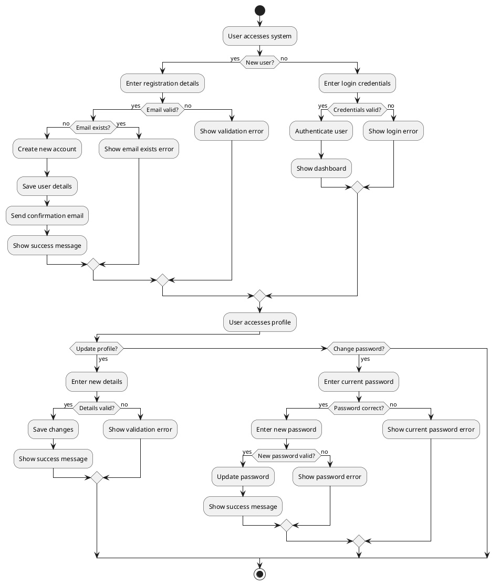
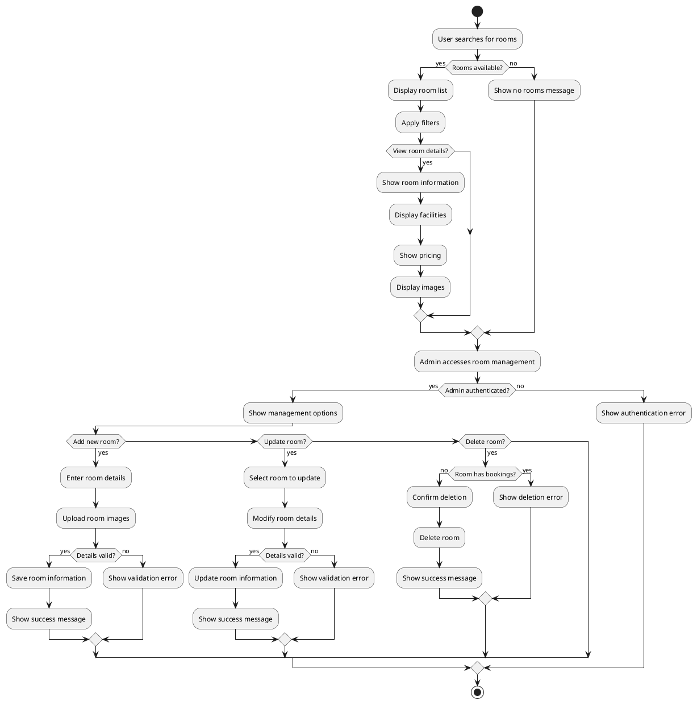
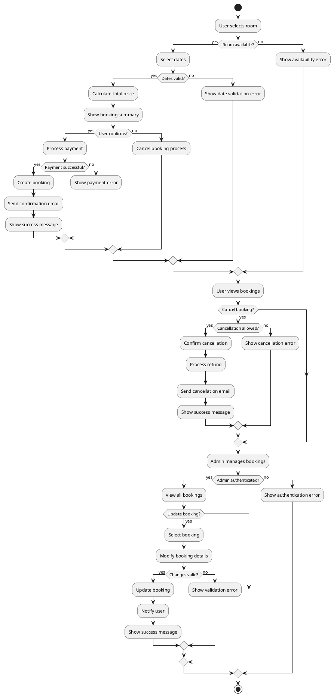
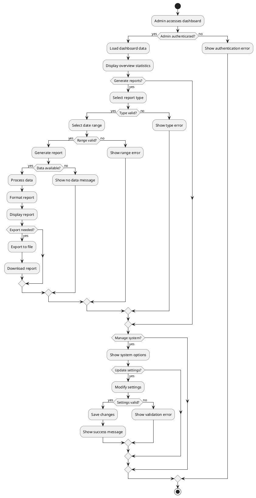
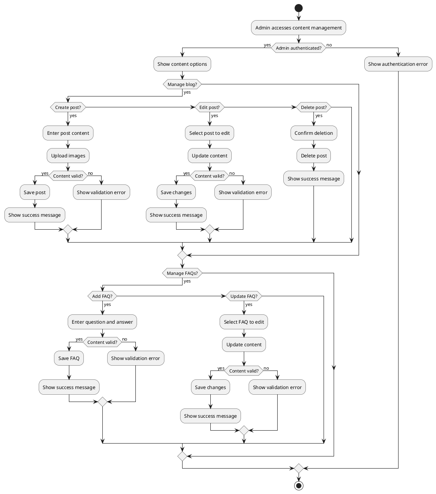
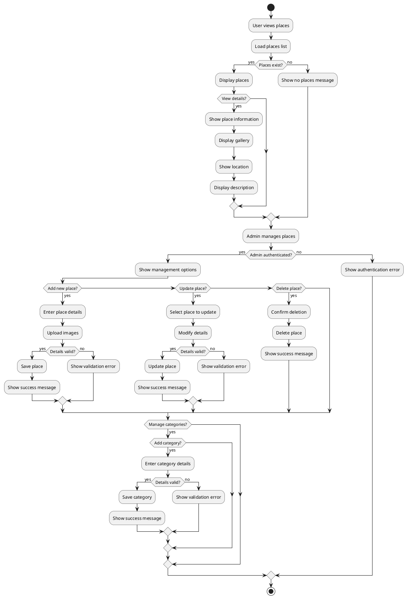
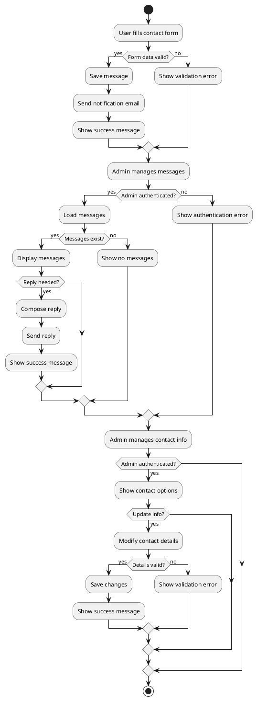
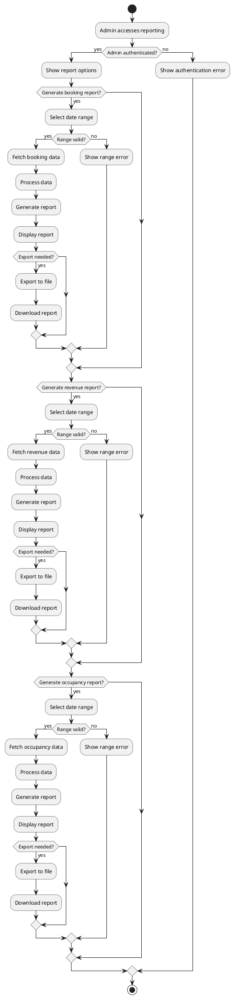

# Activity Diagrams for Hotel Management System

## 1. User Management Activities

## 2. Room Management Activities

## 3. Booking Management Activities

## 4. Admin Dashboard Activities

## 5. Content Management Activities

## 6. Places/Attractions Activities

## 7. Contact/Communication Activities

## 8. Reporting Activities
