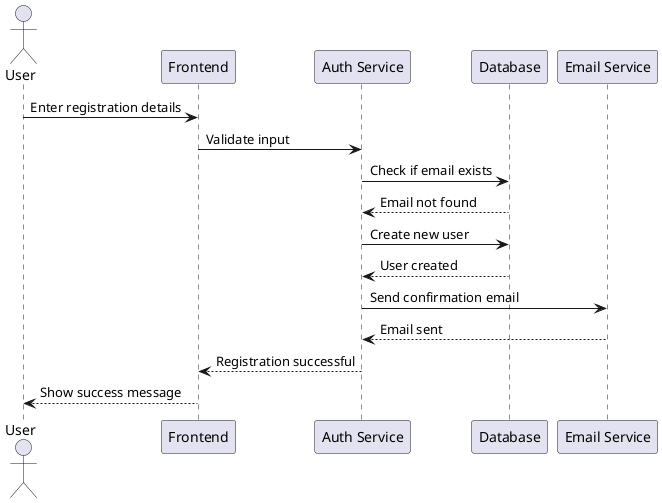
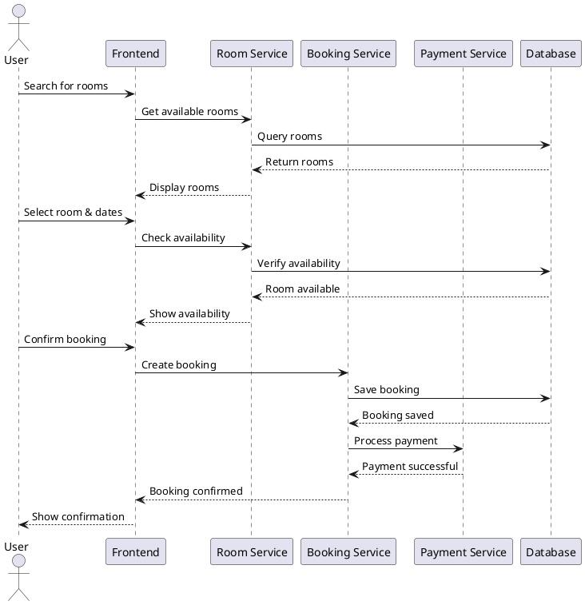
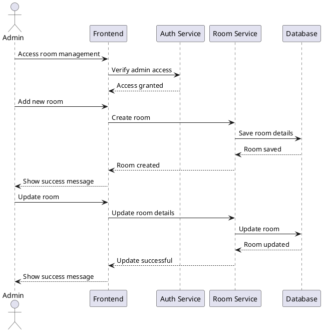
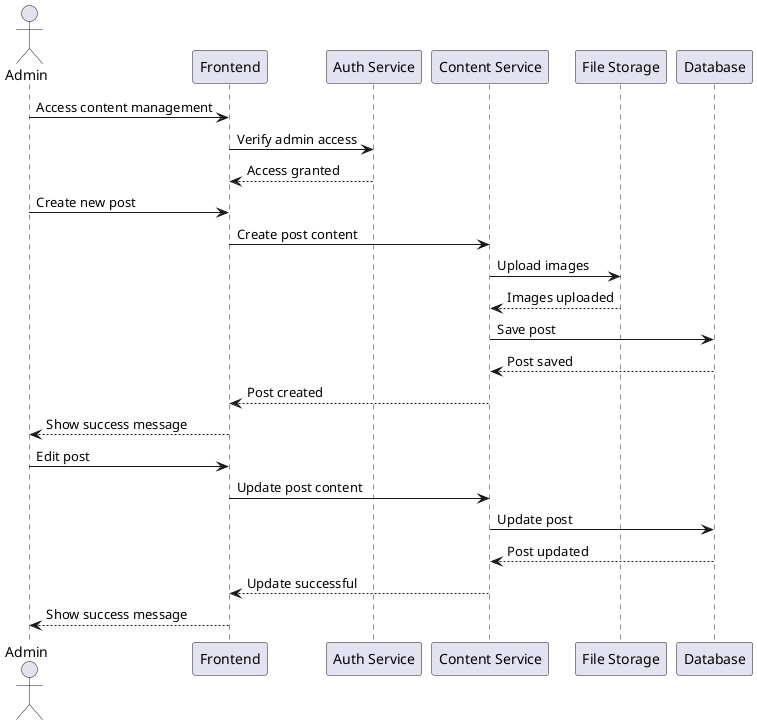
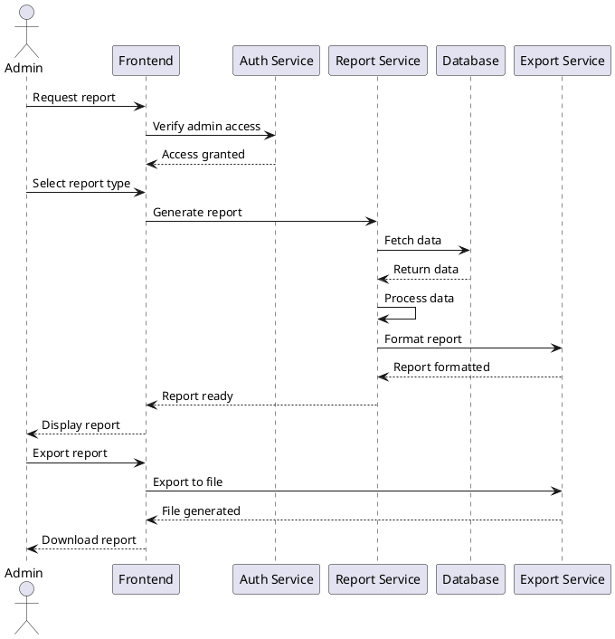
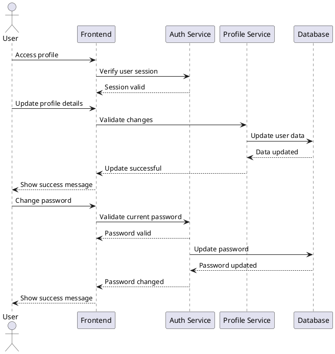
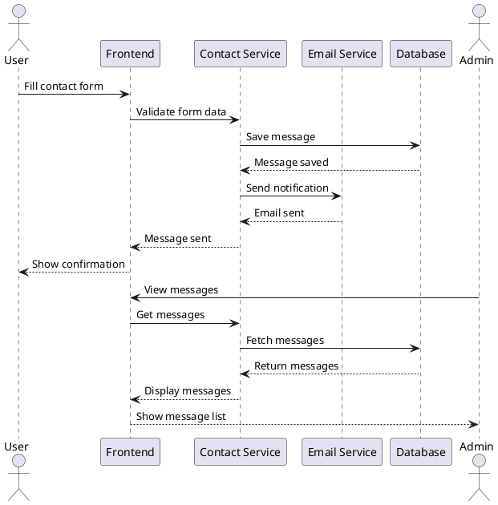
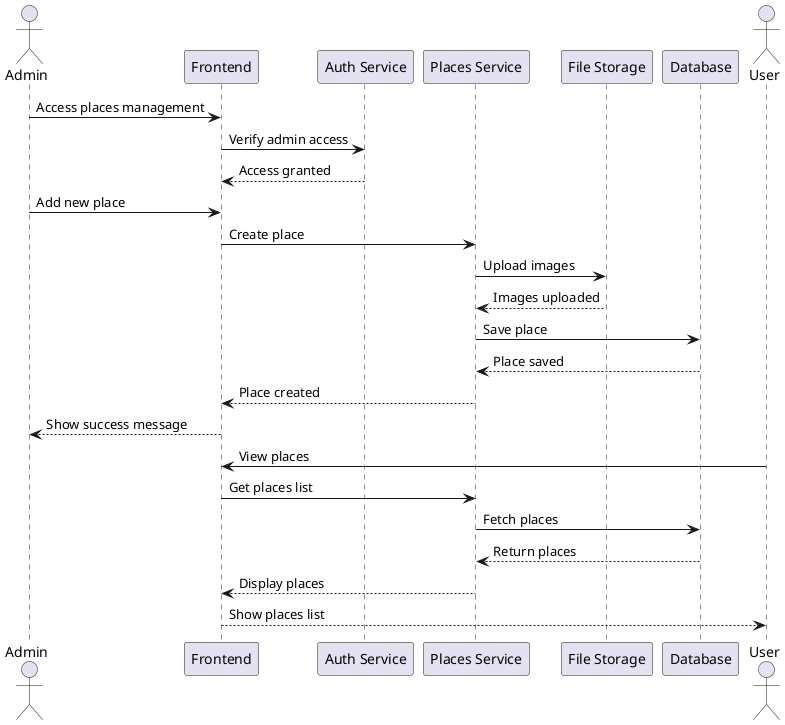

# Sequence Diagrams for Hotel Management System

## 1. User Registration Process

## 2. Room Booking Process

## 3. Admin Room Management Process

## 4. Content Management Process

## 5. Report Generation Process

## 6. User Profile Update Process

## 7. Contact Form Process

## 8. Places/Attractions Management Process
