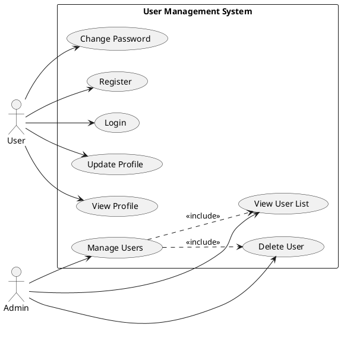
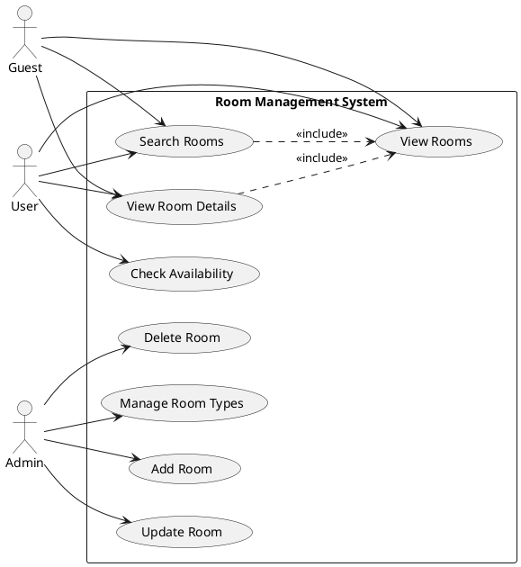
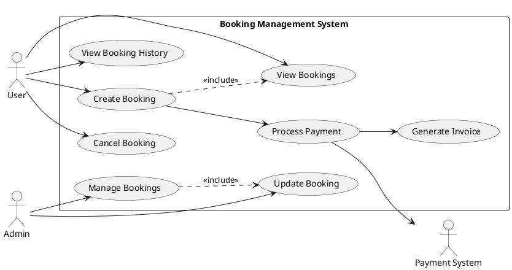
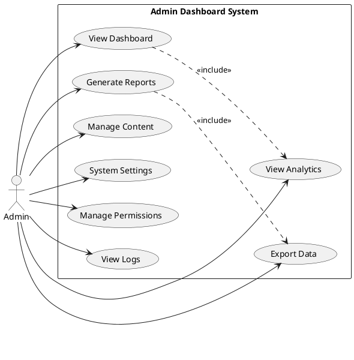
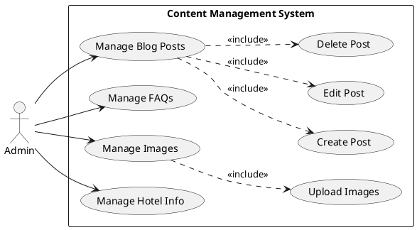
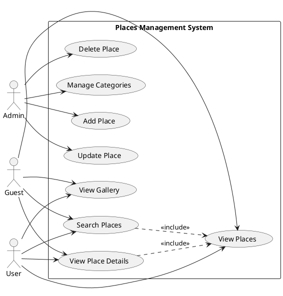
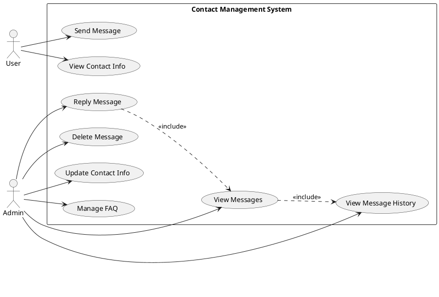
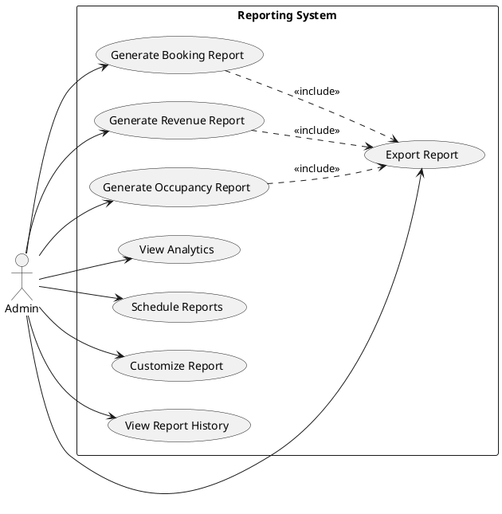

# Use Case Diagrams for Hotel Management System

## 1. User Management Subsystem

## 2. Room Management Subsystem

## 3. Booking Management Subsystem

## 4. Admin Dashboard Subsystem

## 5. Content Management Subsystem

## 6. Places/Attractions Subsystem

## 7. Contact/Communication Subsystem

## 8. Reporting Subsystem
